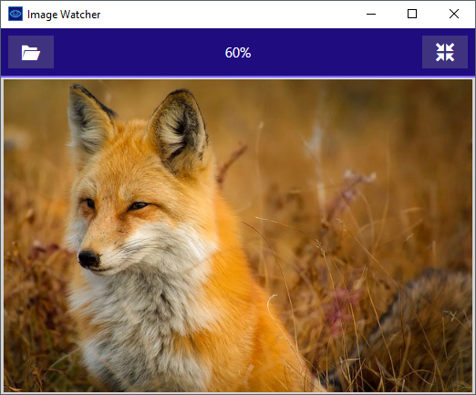

# Image Watcher

A simple image viewer that reloads the image when it changes on disk.

## Features

- Open a file by using the top-left button or drag & drop.
- Resizing the window scales the image.
- Set the image to its original size with the button on the top-right.

## License

The software is licensed under the terms of the [MIT License](LICENSE).

Icons used are from the [IcoMoon-Free](https://icomoon.io) set. Credit for the  [image](https://pixabay.com/en/fox-animal-wildlife-red-macro-1883658/) in the screenshot
above to [tpsdave](https://pixabay.com/en/users/tpsdave-12019/).
